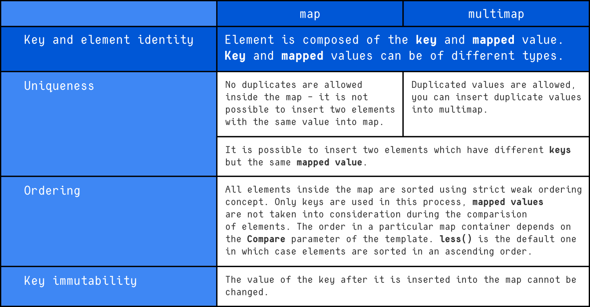

# map and multimap (STL Associative Containers)

The `map` and `multimap` classes are associative containers that store **key–value pairs** as elements. Both are defined in the same header:

```cpp
#include <map>
```

They automatically maintain elements in **sorted order by key** using a comparator that enforces strict weak ordering.

---

# Class Templates

```cpp
template <
    class Key,
    class T,
    class Compare = std::less<Key>,
    class Allocator = std::allocator<std::pair<const Key, T>>
>
class map;

template <
    class Key,
    class T,
    class Compare = std::less<Key>,
    class Allocator = std::allocator<std::pair<const Key, T>>
>
class multimap;
```

---

# Template Parameters

| Parameter   | Description                                               |
| ----------- | --------------------------------------------------------- |
| `Key`       | Type of the key used for ordering and lookup              |
| `T`         | Type of mapped value associated with the key              |
| `Compare`   | Comparator used to order keys (default: `std::less<Key>`) |
| `Allocator` | Allocator used for memory management                      |

---

# Description

Both `map` and `multimap`:

* Store **key–value pairs**
* Maintain elements in **sorted order by key**
* Are implemented using **balanced binary search trees**
* Provide **O(log n)** complexity for `insert`, `erase`, and `find`
* Support **bidirectional iterators**

Each element is of type:

```cpp
std::pair<const Key, T>
```

* `first` → key (immutable)
* `second` → mapped value

---

# Difference Between map and multimap



# Strict Weak Ordering & Comparator

Elements inside a `map` or `multimap` are ordered using a comparator.

The comparator:

* Takes two keys
* Returns `true` if the first key should appear before the second
* Must define **strict weak ordering**

By default:

```cpp
std::less<Key>
```

This requires the `<` operator to be defined for `Key`.

---

# When a Custom Comparator Is Needed

You must provide a custom comparator if:

* The type `Key` does not define `operator<`
* You want a different ordering (e.g., descending)
* You are storing custom objects as keys

---

# Comparator Prototypes

Two possible forms:

## 1. Function Comparator

```cpp
template <class Key>
bool cmp(Key k1, Key k2);
```

## 2. Functional Object (Recommended)

```cpp
template <class Key>
struct CMP {
    bool operator()(const Key& k1, const Key& k2) const;
};
```

⚠ If passing arguments by reference, they must be `const` due to key immutability.

Functional objects are preferred because the comparator type must be supplied as a template parameter.

---

# Important Notes About Keys

* Keys inside `map` are **immutable** (`const Key`)
* Modifying a key directly would break ordering
* To change a key, you must **erase and reinsert** the element
* Ordering cannot be disabled

---

# Constructors

## map Constructors

```cpp
explicit map(const Compare& comp = Compare(),
             const Allocator& = Allocator());

template <class InputIterator>
map(InputIterator first, InputIterator last,
    const Compare& comp = Compare(),
    const Allocator& = Allocator());

map(const map<Key, T, Compare, Allocator>& x);
```

## multimap Constructors

```cpp
explicit multimap(const Compare& comp = Compare(),
                  const Allocator& = Allocator());

template <class InputIterator>
multimap(InputIterator first, InputIterator last,
         const Compare& comp = Compare(),
         const Allocator& = Allocator());

multimap(const multimap<Key, T, Compare, Allocator>& x);
```

---

# Constructor Parameters

| Parameter     | Description                                                     |
| ------------- | --------------------------------------------------------------- |
| `first, last` | Iterator range `[first, last)` used to initialize the container |
| `comp`        | Comparator object (must match `Compare` type)                   |
| `Allocator`   | Allocator object                                                |
| `x`           | Existing container used for copy construction                   |

---

# Constructor Behavior

## 1. Default / Explicit Constructor

* Creates an empty container
* Uses provided comparator and allocator (if supplied)
* Defaults are used if omitted

Example:

```cpp
std::map<int, int> m;
```

---

## 2. Range Constructor

* Creates container using elements from another collection
* Inserts elements from `[first, last)`
* Automatically sorts by key

Example:

```cpp
std::pair<int, int> arr[] = {{4, 40}, {2, 20}, {5, 50}, {1, 10}};

std::map<int, int> m(arr, arr + 4);
```

---

## 3. Copy Constructor

* Creates an exact copy of another container
* Template parameters must match exactly

Example:

```cpp
std::map<int, int> m1;
std::map<int, int> m2(m1);
```

---

# Ordering Behavior

Elements are always stored sorted by **key**:

```cpp
std::map<int, int> m = {
    {5, 50},
    {2, 20},
    {8, 80},
    {1, 10}
};
```

Internally ordered as:

```
1 2 5 8
```

(Ordered by keys, not values.)

You cannot disable ordering in `map` or `multimap`.

---

# Performance

| Operation | Time Complexity      |
| --------- | -------------------- |
| Insert    | O(log n)             |
| Erase     | O(log n)             |
| Find      | O(log n)             |
| Traversal | O(n) (sorted by key) |

---

# When to Use

### Use `map` when:

* Keys must be unique
* You need automatic sorting by key
* You need fast lookup by key

### Use `multimap` when:

* Duplicate keys are allowed
* Multiple values per key are required
* Sorted storage is necessary

---

# Common Issue

When storing custom objects as keys:

You must either:

* Overload `operator<`
* Provide a custom comparator

Otherwise, compilation will fail because `std::less<Key>` cannot compare the objects.

---

# Summary

* `map` and `multimap` are tree-based associative containers
* Elements are stored as `std::pair<const Key, T>`
* Ordering is mandatory and based on keys
* Comparator defines key positioning
* `map` → unique keys
* `multimap` → duplicate keys allowed
