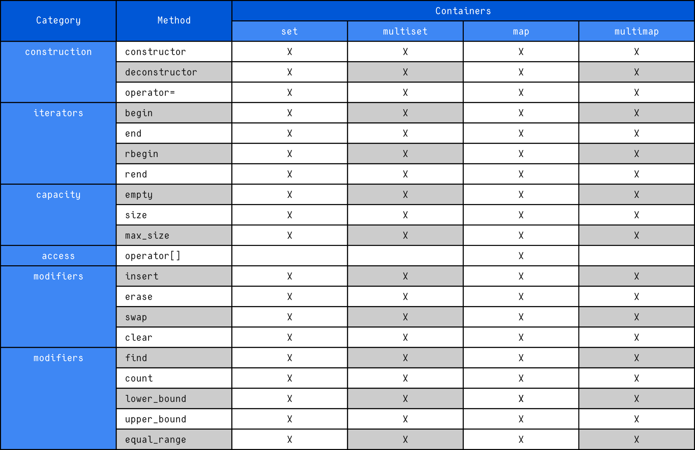

# Associative Containers (STL)

Associative containers are a category of Standard Template Library (STL) containers where elements are accessed using a **key** instead of a positional index.

Unlike sequence containers (e.g., `vector`, `deque`, `list`), which access elements by their position, associative containers organize elements by **key-based lookup**.

---

## Key Concept

In associative containers:

* Each element is associated with a **key**
* Elements are automatically stored in **sorted order**
* Access is performed using the key
* Searching is typically **logarithmic time – O(log n)**

This makes associative containers efficient for lookup operations.

---

## Internal Implementation

Associative containers are typically implemented using:

* **Binary Search Trees (BST)**
* More specifically, **balanced binary trees** (commonly Red-Black Trees)

Because of this:

* Insertions, deletions, and searches are efficient
* Memory usage is generally higher compared to sequence containers
* Iteration traverses elements in sorted order

---

## Associative Containers in STL

The STL provides four associative containers:

### 1. `set`

* Stores **unique keys**
* Keys are automatically sorted
* No duplicate values allowed

Example:

```cpp
std::set<int> s;
s.insert(10);
s.insert(5);
```

---

### 2. `multiset`

* Stores **multiple keys**
* Allows duplicate values
* Elements remain sorted

Example:

```cpp
std::multiset<int> ms;
ms.insert(10);
ms.insert(10);  // allowed
```

---

### 3. `map`

* Stores **key-value pairs**
* Keys are unique
* Elements sorted by key

Example:

```cpp
std::map<int, std::string> m;
m[1] = "Alice";
m[2] = "Bob";
```

---

### 4. `multimap`

* Stores **key-value pairs**
* Allows duplicate keys
* Sorted by key

Example:

```cpp
std::multimap<int, std::string> mm;
mm.insert({1, "Alice"});
mm.insert({1, "Bob"});
```

---

## Comparison Table

| Container  | Stores          | Duplicate Keys | Sorted | Access Method |
| ---------- | --------------- | -------------- | ------ | ------------- |
| `set`      | Keys only       | ❌ No          | ✅ Yes  | By key       |
| `multiset` | Keys only       | ✅ Yes         | ✅ Yes  | By key       |
| `map`      | Key-value pairs | ❌ No          | ✅ Yes  | By key       |
| `multimap` | Key-value pairs | ✅ Yes         | ✅ Yes  | By key       |

---

## Performance Characteristics

| Operation | Time Complexity |
| --------- | --------------- |
| Insert    | O(log n)        |
| Erase     | O(log n)        |
| Find      | O(log n)        |

---

## When to Use Associative Containers

Use associative containers when:

* You need fast lookups by key
* You need automatically sorted data
* You require unique keys (`set`, `map`)
* You need duplicates allowed (`multiset`, `multimap`)

---

## Notes

* Elements are always sorted based on a comparison function (`std::less` by default).
* Custom comparators can be provided.
* Memory overhead is higher than sequence containers due to tree structure.

---

## Summary

Associative containers provide:

* Efficient key-based access
* Automatic sorting
* Logarithmic performance
* Tree-based internal structure

They are ideal when order and fast searching are more important than memory footprint or random-access performance.


