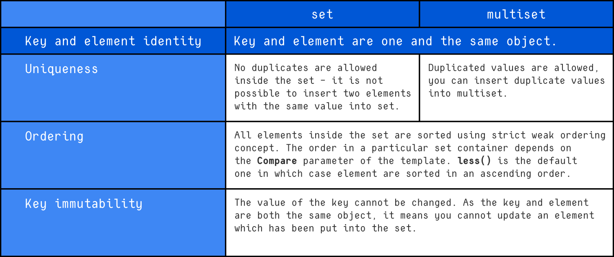

# `set` and `multiset` (STL Associative Containers)

The `set` and `multiset` classes are associative containers that store **keys as elements**.
Both are defined in the same header:

```cpp
#include <set>
```

They automatically maintain elements in **sorted order** using a comparator that enforces **strict weak ordering**.

---

## Class Templates

```cpp
template <
    class Key,
    class Compare = std::less<Key>,
    class Allocator = std::allocator<Key>
>
class set;

template <
    class Key,
    class Compare = std::less<Key>,
    class Allocator = std::allocator<Key>
>
class multiset;
```

---

## Template Parameters

| Parameter   | Description                                                   |
| ----------- | ------------------------------------------------------------- |
| `Key`       | Type of key stored in the container (also the element type)   |
| `Compare`   | Comparator used to order elements (default: `std::less<Key>`) |
| `Allocator` | Allocator used for memory management                          |

---

## Description

Both `set` and `multiset`:

* Store **keys only** (no separate value)
* Maintain elements in **sorted order**
* Are implemented using **balanced binary search trees**
* Provide **O(log n)** complexity for insert, erase, and find

### Difference Between `set` and `multiset`



# Strict Weak Ordering & Comparator

Elements inside a `set` or `multiset` are ordered using a **comparator**.

The comparator:

* Takes two arguments
* Returns `true` if the first element should appear **before** the second
* Must define a **strict weak ordering**

By default:

```cpp
std::less<Key>
```

This requires the `<` operator to be defined for `Key`.

---

## When a Custom Comparator Is Needed

You must provide a custom comparator if:

* The type `Key` does not define `operator<`
* You want a different ordering (e.g., descending)
* You are storing custom objects

---

## Comparator Prototypes

Two possible forms:

### 1. Function Comparator

```cpp
template <class Key>
bool cmp(Key k1, Key k2);
```

### 2. Functional Object (Recommended)

```cpp
template <class Key>
struct CMP {
    bool operator()(const Key& k1, const Key& k2) const;
};
```

⚠ If passing arguments by reference, they must be `const` due to key immutability.

Functional objects are preferred because the comparator type must be supplied as a template parameter.

---

## Important Notes About Keys

* Keys inside `set` are **immutable**
* Modifying a key directly would break ordering
* To change a key, you must erase and reinsert it

---

# Constructors

---

## `set` Constructors

```cpp
explicit set(const Compare& comp = Compare(),
             const Allocator& = Allocator());

template <class InputIterator>
set(InputIterator first, InputIterator last,
    const Compare& comp = Compare(),
    const Allocator& = Allocator());

set(const set<Key, Compare, Allocator>& x);
```

---

## `multiset` Constructors

```cpp
explicit multiset(const Compare& comp = Compare(),
                  const Allocator& = Allocator());

template <class InputIterator>
multiset(InputIterator first, InputIterator last,
         const Compare& comp = Compare(),
         const Allocator& = Allocator());

multiset(const multiset<Key, Compare, Allocator>& x);
```

---

## Constructor Parameters

| Parameter       | Description                                                     |
| --------------- | --------------------------------------------------------------- |
| `first`, `last` | Iterator range `[first, last)` used to initialize the container |
| `comp`          | Comparator object (must match `Compare` type)                   |
| `Allocator`     | Allocator object                                                |
| `x`             | Existing container used for copy construction                   |

---

## Constructor Behavior

### 1. Default / Explicit Constructor

* Creates an empty container
* Uses provided comparator and allocator (if supplied)
* If omitted, defaults are used

Example:

```cpp
std::set<int> s;
```

---

### 2. Range Constructor

* Creates container using elements from another collection
* Inserts elements from `[first, last)`
* Automatically sorts them

Example:

```cpp
int arr[] = {4, 2, 5, 1};

std::set<int> s(arr, arr + 4);
```

---

### 3. Copy Constructor

* Creates an exact copy of another container
* Template parameters must match exactly

Example:

```cpp
std::set<int> s1;
std::set<int> s2(s1);
```

---

# Ordering Behavior

Elements are always stored in sorted order:

```cpp
std::set<int> s = {5, 2, 8, 1};
```

Internally becomes:

```
1 2 5 8
```

You cannot disable ordering in `set` or `multiset`.

---

# Performance

| Operation | Time Complexity     |
| --------- | ------------------- |
| Insert    | O(log n)            |
| Erase     | O(log n)            |
| Find      | O(log n)            |
| Traversal | O(n) (sorted order) |

---

# When to Use

### Use `set` when:

* You need unique elements
* You need automatic sorting
* You need fast lookup

### Use `multiset` when:

* Duplicates are allowed
* Sorted storage is required
* Counting occurrences matters

---

# Common Issue

When storing custom objects:

* You must either:

  * Overload `operator<`
  * Provide a custom comparator

Otherwise, compilation will fail because `std::less<Key>` cannot compare objects.

---

# Summary

* `set` and `multiset` are tree-based associative containers
* Elements are keys themselves
* Ordering is mandatory
* Comparator defines element positioning
* `set` → unique keys
* `multiset` → duplicate keys allowed
