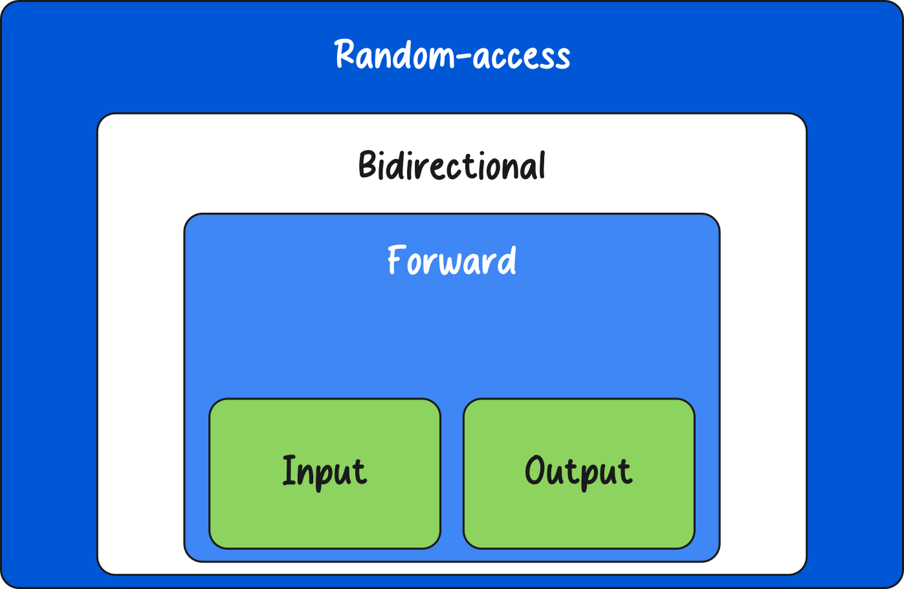
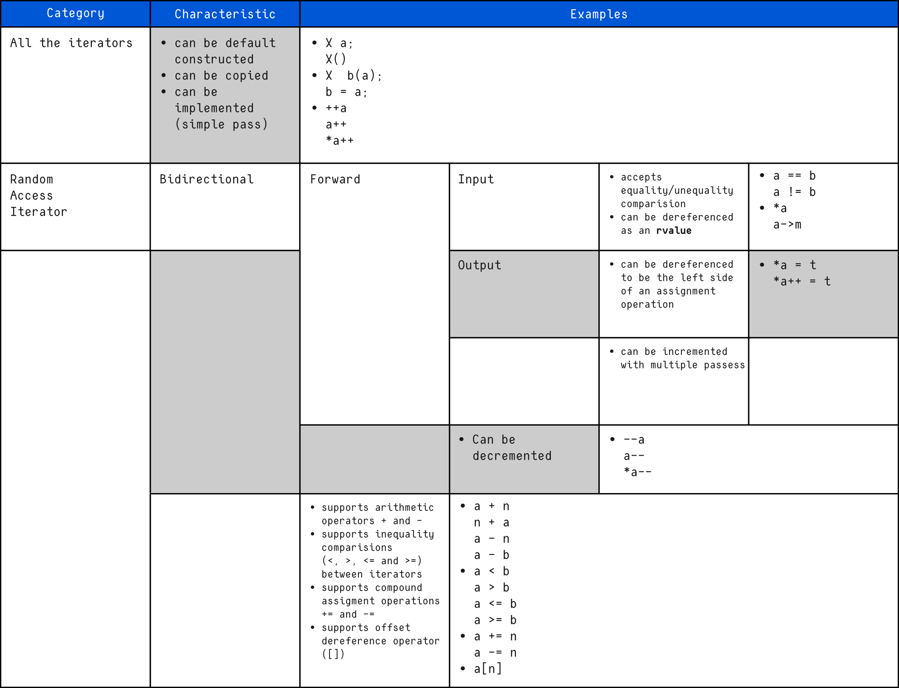
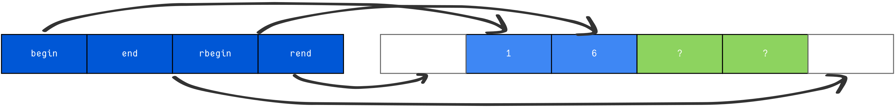

# STL Iterators Overview

## What Is an Iterator?

An **iterator** is an object that allows traversal through the elements of a container.

In many ways, an iterator is similar to a **pointer**:

* It can reference elements in a container.
* It can be incremented to move to the next element.
* It can be dereferenced to access the value it points to.

In some cases (such as with `std::vector`), iterators may internally behave very much like pointers.

---

## Iterator Categories



There are **five categories of iterators**, each defined by the operations they support:

| Iterator Type          | Capabilities                            |
| ---------------------- | --------------------------------------- |
| Input Iterator         | Read values, move forward               |
| Output Iterator        | Write values, move forward              |
| Forward Iterator       | Read/write, move forward multiple times |
| Bidirectional Iterator | Move forward and backward               |
| Random Access Iterator | Direct indexing, arithmetic operations  |



### Container Support

* `std::vector` → Random access iterators
* `std::deque` → Random access iterators
* `std::list` → Bidirectional iterators

A container’s internal structure determines which iterator category it supports.

For example:

* A `vector` supports random access because it stores elements contiguously.
* A `list` does not support random access because it is implemented as a doubly linked list.

However, if a function requires a **bidirectional iterator**, you can pass any iterator that satisfies that requirement, regardless of the container it belongs to.

---

## Iterator Types Inside Containers

Every standard container defines four iterator-related member types:

```cpp
iterator
const_iterator
reverse_iterator
const_reverse_iterator
```

### Description

* **iterator** – Read/write iterator
* **const_iterator** – Read-only iterator
* **reverse_iterator** – Iterates from the end to the beginning
* **const_reverse_iterator** – Reverse iteration (read-only)

Although these type names are consistent across containers, their actual implementations differ depending on the container type.

---

## Initializing Iterators

To use an iterator, you must initialize it using one of the container’s member functions.

All standard containers provide the following methods:

```cpp
iterator begin();
const_iterator begin() const;

iterator end();
const_iterator end() const;

reverse_iterator rbegin();
const_reverse_iterator rbegin() const;

reverse_iterator rend();
const_reverse_iterator rend() const;
```

---

## Iterator Initialization Methods Explained

### `begin()`

Returns an iterator pointing to the **first element** of the container.

---

### `end()`

Returns an iterator pointing to the **past-the-end element**.

Important:

* It does NOT point to the last element.
* It points to the element *after* the last one.
* If a container has `n` elements, `end()` refers to position `n + 1` (a non-existent, virtual element).

---

### `rbegin()`

“Reverse begin”

Returns an iterator pointing to the **last element** of the container.

---

### `rend()`

“Reverse end”

Returns an iterator pointing to the position **before the first element**.

It marks the end of the container in reverse iteration.

---

## The Past-the-End Element

The **past-the-end element** is a virtual position located immediately after the last real element in a container.

It:

* Does not store data.
* Cannot be dereferenced.
* Serves as a stopping condition for iteration.



Example:

```cpp
for (std::vector<int>::iterator it = v.begin(); it != v.end(); ++it)
{
    std::cout << *it << std::endl;
}
```

The loop stops when `it` reaches the past-the-end position.

---

## Example: Basic Iteration

```cpp
std::vector<int> v = {1, 2, 3, 4};

for (std::vector<int>::iterator it = v.begin(); it != v.end(); ++it)
{
    std::cout << *it << std::endl;
}
```
