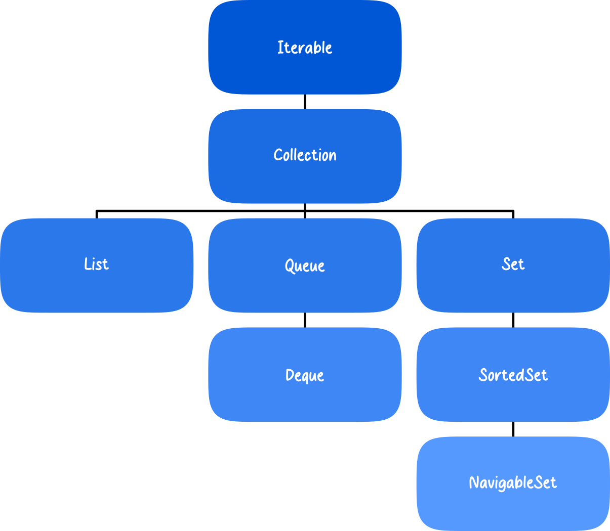

# C++ Advanced

## What is STL?

**STL** stands for **Standard Template Library**. It is a fundamental part of the C++ development environment, and if you intend to become a serious C++ programmer, learning STL is essential.

So what is STL good for?

In general, it provides ready-to-use solutions for many common programming problems. Instead of writing data structures and algorithms from scratch, STL gives you highly optimized, well-tested, and standardized components.

The word **“standard”** is important. Every modern C++ compiler includes STL as part of the language standard. This means that programs written using STL are highly portable across platforms and compilers (program portability itself is a broader topic, but STL strongly supports it).

---

## STL Structure

Conceptually, STL is divided into two main parts:

* **Containers** - store data.
* **Algorithms** - operate on data stored in containers.

---

## STL Overview Diagram



---

## 📚 Modules

---

## Module 1: STL Sequential Containers

Learn how to work with sequential data structures provided by the C++ Standard Library.

### Topics Covered

* Types of sequential containers
* `vector`, `deque`, `list` and their APIs
* Sequential container adapters:

  * `stack`
  * `queue`
  * `priority_queue`
* Working with objects as container elements
* When to use each container

### Learning Outcome

Understand memory layout, performance trade-offs, and appropriate use cases for each sequential container.

---

## Module 2: STL Associative Containers

Explore containers optimized for fast lookup operations.

### Topics Covered

* Types of associative containers
* `set` and `multiset` – behavior and API
* `map` and `multimap` – behavior and API
* Storing objects in `set` and `map`
* When to use each container

### Learning Outcome

Be able to choose between ordered associative containers and use them efficiently in real-world scenarios.

---

## Module 3: Non-modifying STL Algorithms

Understand algorithms that inspect ranges without altering them.

### Topics Covered

* Definition of non-modifying algorithms
* Algorithms:

  * `for_each`
  * `find`, `find_if`
  * `find_end`, `find_first_of`
  * `adjacent_find`
  * `count`, `count_if`
  * `mismatch`, `equal`
  * `search`, `search_n`
* Examples
* Container compatibility

### Learning Outcome

Apply read-only algorithms to efficiently query and analyze container data.

---

## Module 4: Modifying STL Algorithms

Learn algorithms that change the contents of containers.

### Topics Covered

* Definition of modifying algorithms
* Algorithms:

  * `transform`
  * `copy`, `copy_backward`
  * `swap`, `swap_ranges`, `iter_swap`
  * `replace`
  * `fill`, `fill_n`
  * `generate`, `generate_n`
  * `remove`, `remove_if`
  * `unique`, `unique_copy`
  * `reverse`, `reverse_copy`
  * `rotate`
  * `partition`, `stable_partition`
* Examples
* Container compatibility

### Learning Outcome

Master in-place modification and data transformation techniques using STL algorithms.

---

## Module 5: Sorting STL Operations

Understand sorting mechanisms and binary search utilities.

### Topics Covered

* Sorting algorithms:

  * `random_shuffle`
  * `sort`
  * `stable_sort`
  * `lower_bound`
  * `upper_bound`
  * `equal_range`
  * `binary_search`
* Examples
* Container compatibility
* Sorting custom objects

### Learning Outcome

Write efficient sorting logic and implement custom comparison functions.

---

## Module 6: STL Merge Operations

Learn how to combine and compare sorted ranges.

### Topics Covered

* Merging algorithms:

  * `merge`
  * `includes`
  * `min_element`
  * `max_element`
  * `inplace_merge`
* STL operations for sets
* Examples
* Container compatibility

### Learning Outcome

Perform advanced set operations and efficiently merge sorted sequences.

---

## Module 7: STL Utilities and Functional Library

Discover powerful helper tools in the STL.

### Topics Covered

* STL “small” tools
* Useful functors
* Practical examples

### Learning Outcome

Use function objects and utilities to write cleaner and more expressive code.

---

## Module 8: STL Advanced I/O

Master input and output operations in C++.

### Topics Covered

* I/O stream classes
* Console I/O
* Formatting output
* File I/O
* String streams
* Examples

### Learning Outcome

Build robust console and file-based applications with formatted input/output.

---

## Module 9: Templates

Learn the foundation of generic programming in C++.

### Topics Covered

* What are templates?
* Basic syntax
* Function templates
* Class templates
* When to use templates
* Common template pitfalls

### Learning Outcome

Write reusable, type-safe, generic code using templates.

---

## 🛠 Requirements

* Basic knowledge of C++
* Understanding of:

  * Classes
  * Pointers and references
  * Basic OOP principles
* C++11 or newer compiler recommended

---

## 🚀 How to Use This Repository

Each module contains:

* Theory notes
* Code examples
* Practice exercises

It is recommended to:

1. Study the theory
2. Run and modify the examples
3. Complete the exercises
4. Experiment with your own variations

---

## 📌 Recommended Compiler

* `g++` (C++17 or later)
* `clang++`
* MSVC (Visual Studio)

Example compilation:

```bash
g++ -std=c++17 main.cpp -o program
./program
```

---

## 📖 License

This course material is intended for educational purposes.
