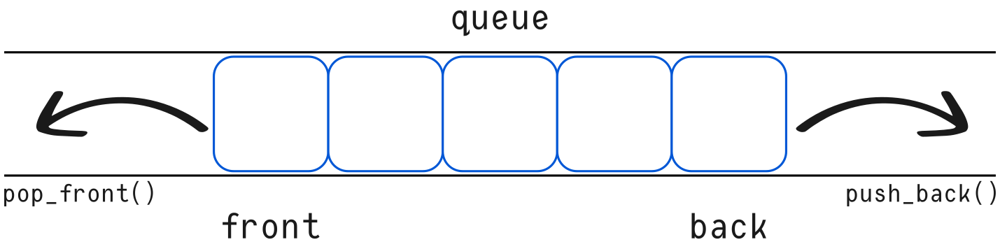

# Queue (STL Container Adaptor)

`queue` is a Standard Template Library (STL) container adaptor that provides **FIFO (First-In, First-Out)** functionality.

It allows elements to be:

* **Inserted (pushed)** at the back
* **Removed (popped)** from the front

Internally, `queue` uses another container as its storage backend.

---

## Template Definition

```cpp
template <class T, class Container = deque<T>>
class queue;
```

---

## Template Parameters

| Parameter   | Description                                                       |
| ----------- | ----------------------------------------------------------------- |
| `T`         | Type of elements stored in the queue                              |
| `Container` | Type of the underlying storage container (defaults to `deque<T>`) |

If `Container` is not explicitly specified, `std::deque<T>` is used by default.

---

## Description

`queue` is implemented as a **container adaptor**, meaning it wraps another container and restricts its interface to provide queue-specific behavior.

To function properly, the underlying container must provide the following methods:

* `front()`
* `back()`
* `push_back()`
* `pop_front()`

### Compatible Containers

The following STL containers satisfy these requirements:

* `std::deque`
* `std::list`

Any custom container implementing the required interface can also be used.

---

## FIFO Behavior

The queue follows the First-In, First-Out principle:



* Elements are **added at the back**
* Elements are **removed from the front**

---

# 1.5.9 Queue – Initialization

Most `queue` methods are **proxy methods**, meaning they internally call the corresponding method of the underlying container.

---

## Constructors

### 1. Explicit Constructor

```cpp
explicit queue(const Container& cont = Container());
```

### Parameters

| Parameter | Description                                                                   |
| --------- | ----------------------------------------------------------------------------- |
| `cont`    | Container used as internal storage. Must match the declared `Container` type. |

### Description

* Initializes the queue using the provided container.
* The container **does not need to be empty**.
* The container type must match the `Container` template parameter exactly.

Example:

```cpp
std::deque<int> d = {1, 2, 3};
std::queue<int> q(d);
```

---

### 2. Copy Constructor

```cpp
queue(const queue& other);
```

### Parameters

| Parameter | Description                                     |
| --------- | ----------------------------------------------- |
| `other`   | Existing queue used to initialize the new queue |

### Description

* Creates a new queue as a copy of `other`.
* Both queues must use the **same underlying container type**.
* The internal container is copied.

Example:

```cpp
std::queue<int> q1;
std::queue<int> q2(q1);
```

---

## Key Notes

* `queue` does **not** provide iterators.
* Direct access to internal elements (other than `front()` and `back()`) is not allowed.
* It enforces strict FIFO access control.
* It is built on top of another container rather than storing elements directly.

---

## Summary

| Feature           | Details                                                          |
| ----------------- | ---------------------------------------------------------------- |
| Access Pattern    | FIFO                                                             |
| Default Container | `std::deque`                                                     |
| Custom Container  | Must implement `front()`, `back()`, `push_back()`, `pop_front()` |
| Iterators         | Not supported                                                    |
| Type              | Container adaptor                                                |

---

## When to Use `queue`

Use `queue` when:

* You need strict FIFO behavior
* You want to restrict access to elements
* You don’t need random access or iteration
