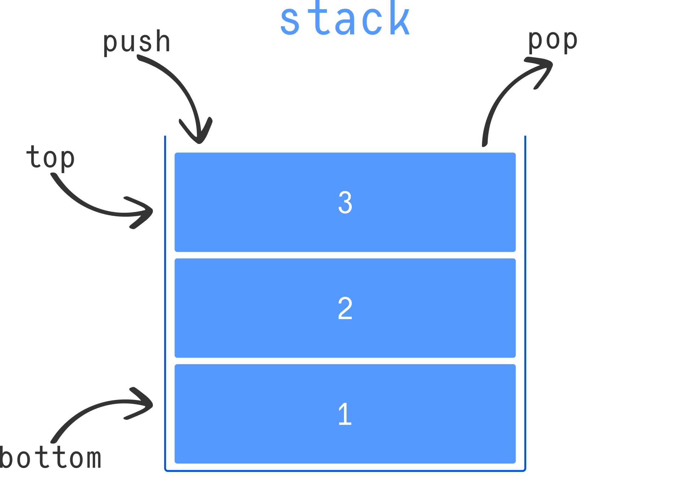

# `std::stack` Overview

## Class Signature

```cpp
template <class T, class Container = std::deque<T>>
class stack;
```

---

## Template Parameters

### `T`

The type of elements stored in the stack.

### `Container`

The type of the underlying storage container.

* Default: `std::deque<T>`
* Must support specific member functions required by `stack`
* Can be replaced with another compatible container (e.g., `std::vector`, `std::list`)

---

## Description

`std::stack` is an STL container adaptor that implements the **LIFO (Last-In, First-Out)** data structure.

In a stack:

* Elements are inserted at one end called the **top**.
* Only the top element can be accessed or removed.
* The most recently added element is the first one removed.

This structure restricts access — unlike other containers, you cannot iterate through a stack or access arbitrary elements.

---

## Required Interface of the Underlying Container

The internal container used by `std::stack` must provide:

```cpp
back()
push_back()
pop_back()
```

Because of this requirement, the following sequential containers can be used:

* `std::deque` (default)
* `std::vector`
* `std::list`

If no container is specified, `std::deque` is used automatically.

---

## Stack Object Initialization

### Constructor

```cpp
explicit stack(const Container& cont = Container());
stack(const stack& other);
```

---

## Constructor Parameters

### `cont`

A container that will serve as the internal storage.

* Must be of the same type as defined in the `Container` template parameter.
* Does **not** need to be empty.
* Existing elements inside `cont` will become the initial contents of the stack.

---

### `other`

An existing stack used to initialize a new stack.

* Performs a copy construction.
* The internal container type must match.

---

## Example Usage

### Default Stack (using `deque`)

```cpp
std::stack<int> s;
```

---

### Stack Using `vector` as Underlying Container

```cpp
std::stack<int, std::vector<int>> s;
```

---

### Stack Initialized with Existing Container

```cpp
std::deque<int> d = {1, 2, 3};
std::stack<int> s(d);
```

In this case:

* `3` becomes the top element of the stack.

---

## Core Stack Operations

Common member functions include:

* `push()` – Insert element at the top
* `pop()` – Remove the top element
* `top()` – Access the top element
* `empty()` – Check if stack is empty
* `size()` – Get number of elements



---

## Key Characteristics

* ✔ Implements LIFO behavior
* ✔ Restricts access to one end only
* ✔ Built on top of another container
* ✔ Simple and efficient
* ❌ No iterators
* ❌ No random access

---

## Summary

`std::stack` is a container adaptor that provides a clean and simple interface for stack operations.

It:

* Uses an underlying sequential container
* Restricts access to enforce LIFO behavior
* Defaults to `std::deque` but allows customization

Use `std::stack` when you need strict last-in, first-out behavior and do not require element traversal.
