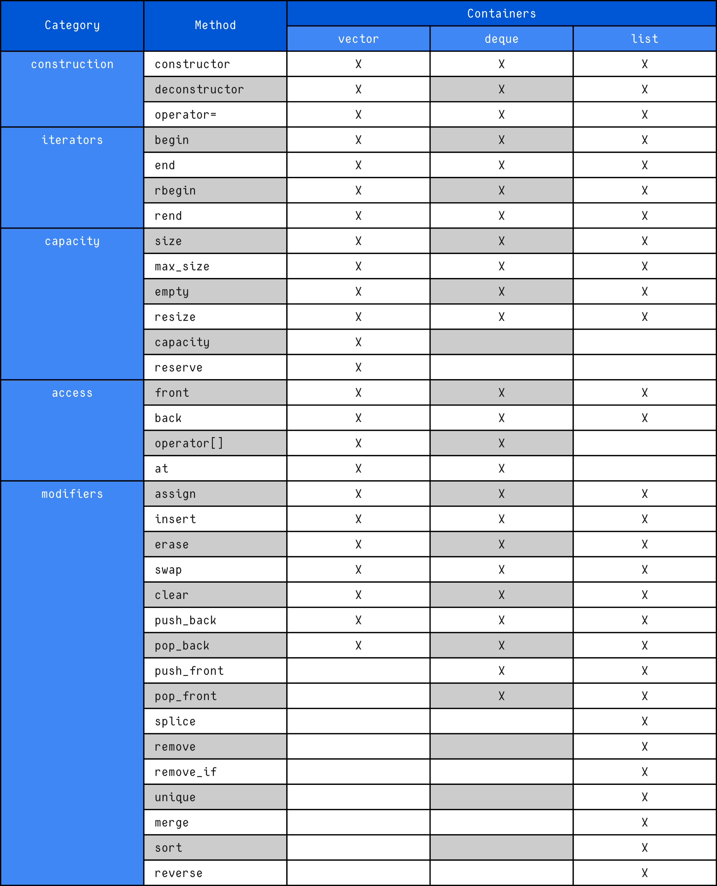

# STL Sequence Containers

## Overview

**Sequence containers** are STL containers that store elements in a **linear arrangement**.

These containers:

* Maintain the order of elements.
* Allow the programmer to control where elements are inserted.
* Do **not automatically sort or reorder elements**.
* Preserve elements in the exact sequence defined by the user.

In other words, the container itself does **not influence the order** — the programmer determines it.

---

## Characteristics of Sequence Containers

* ✔ Elements are arranged in a linear sequence
* ✔ Order is fully controlled by the programmer
* ✔ Support insertion and removal operations
* ✔ Work with iterators and STL algorithms
* ❌ Do not automatically sort elements

---

## Types of STL Sequence Containers

The STL provides **three sequence containers**:

---

### 1. `std::vector`

A dynamic array that:

* Stores elements in **contiguous memory**
* Allows **fast random access** (O(1))
* Supports fast insertion at the end
* May require reallocation when growing

Best used when:

* Frequent access by index is required
* Insertions mainly occur at the back

---

### 2. `std::deque`

A double-ended queue that:

* Does **not require contiguous memory**
* Allows fast insertion at both the front and back
* Supports random access

Best used when:

* Insertions/removals occur at both ends
* Random access is still required

---

### 3. `std::list`

A doubly linked list that:

* Stores elements in non-contiguous memory
* Allows fast insertion and deletion anywhere
* Does **not support random access**

Best used when:

* Frequent insertions/removals occur in the middle
* Random access is not needed

---

## Comparison Table

| Feature            | `vector`   | `deque`   | `list`         |
| ------------------ | ---------- | --------- | -------------- |
| Memory Layout      | Contiguous | Segmented | Non-contiguous |
| Random Access      | ✔          | ✔         | ❌             |
| Fast Front Insert  | ❌         | ✔         | ✔              |
| Fast Back Insert   | ✔          | ✔         | ✔              |
| Fast Middle Insert | ❌         | ❌        | ✔              |
| Automatic Sorting  | ❌         | ❌        | ❌             |

---

## Summary

STL sequence containers provide flexible storage where:

* The **programmer controls element order**
* Elements are stored sequentially
* Different containers optimize different operations

Choose the container based on:

* Access patterns
* Insertion/removal needs
* Memory and performance considerations

