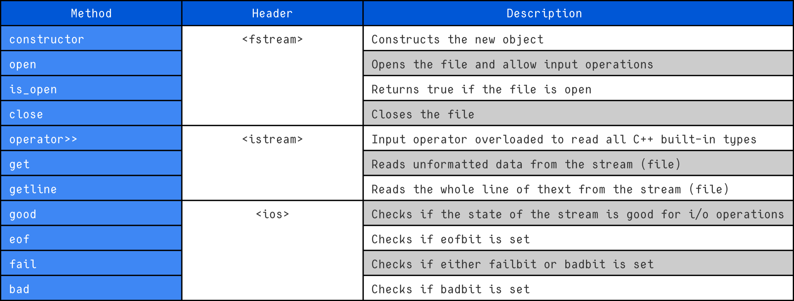
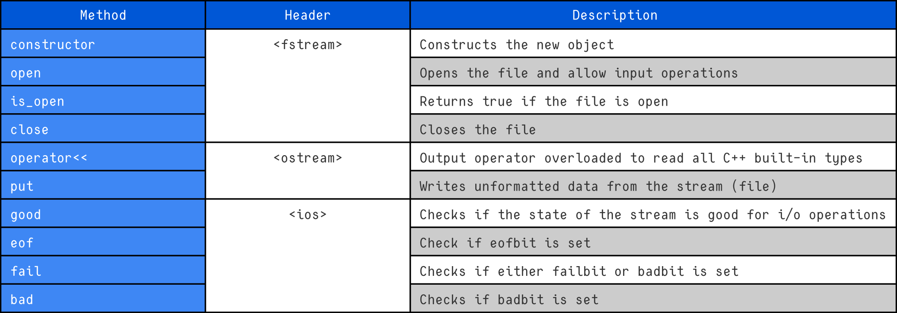

# File Streams

File streams provide input and output operations for files.

The `<fstream>` header provides three main file-stream classes:

- `std::ifstream` — input from a file;
- `std::ofstream` — output to a file;
- `std::fstream` — both input and output.

All three classes support the standard stream extraction (`>>`) and insertion (`<<`) operators.

```cpp
#include <fstream>
```

The three classes can be compared with the string-stream classes:

| File stream | String stream   | Purpose        |
| ----------- | --------------- | -------------- |
| `ifstream`  | `istringstream` | Input          |
| `ofstream`  | `ostringstream` | Output         |
| `fstream`   | `stringstream`  | Input + output |

The main difference is the source or destination of the data:

```text
ifstream / ofstream / fstream
            ↓
           File

istringstream / ostringstream / stringstream
            ↓
        std::string
```

---

# `ifstream`

`std::ifstream` is used for **reading data from a file**.



It derives from `std::istream`, so it provides the same input operations such as:

```cpp
>>
getline()
get()
```

The main functionality specific to `ifstream` is opening and closing files.

## Constructor

**Signature:**

```cpp
ifstream();

explicit ifstream(
    const char* filename,
    ios_base::openmode mode = ios_base::in
);
```

### Parameters

* `filename` – the name of the file to open. It can contain a relative or fully qualified path;
* `mode` – the mode in which the file is opened.

Common file-opening modes include:

| Mode               | Meaning                                                                        |
| ------------------ | ------------------------------------------------------------------------------ |
| `ios_base::app`    | Append. The output position is moved to the end before every output operation. |
| `ios_base::ate`    | At end. The position is moved to the end immediately after opening.            |
| `ios_base::binary` | Opens the file in binary mode.                                                 |
| `ios_base::in`     | Opens the file for input.                                                      |
| `ios_base::out`    | Opens the file for output.                                                     |
| `ios_base::trunc`  | Discards the existing contents of the file when it is opened.                  |

### Description

The first constructor creates an unassociated `ifstream` object.

A file can later be associated with it using `open()`:

```cpp
std::ifstream file;

file.open("data.txt");
```

The second constructor creates the stream and immediately attempts to open the specified file:

```cpp
std::ifstream file("data.txt");
```

If the file cannot be opened, the stream's `failbit` is set.

The state can be checked using:

```cpp
file.fail();
```

or:

```cpp
if (!file)
{
    std::cerr << "Failed to open file\n";
}
```

---

# Reading from a File

Once a file has been successfully opened, the normal input-stream operations can be used.

```cpp
#include <fstream>
#include <iostream>

int main()
{
    std::ifstream file("data.txt");

    if (!file)
    {
        std::cerr << "Failed to open file\n";
        return 1;
    }

    int value;

    file >> value;

    if (!file)
    {
        std::cerr << "Failed to read an integer\n";
        return 1;
    }

    std::cout << "Value: " << value << '\n';
}
```

`ifstream` can also be used to read an entire line:

```cpp
std::string line;

if (std::getline(file, line))
{
    std::cout << line << '\n';
}
```

---

# `ofstream`

`std::ofstream` is used for **writing data to a file**.



It derives from `std::ostream`, so it provides the standard output operations such as:

```cpp
<<
put()
write()
```

## Constructor

**Signature:**

```cpp
ofstream();

explicit ofstream(
    const char* filename,
    ios_base::openmode mode = ios_base::out
);
```

### Parameters

* `filename` – the name of the file to open. It can contain a relative or fully qualified path;
* `mode` – the mode in which the file is opened.

The same opening modes available to `ifstream` can be used.

### Description

The first constructor creates an unassociated `ofstream` object.

A file can later be associated with it using `open()`:

```cpp
std::ofstream file;

file.open("output.txt");
```

The second constructor creates the stream and immediately attempts to open the specified file:

```cpp
std::ofstream file("output.txt");
```

If the file cannot be opened, the stream's `failbit` is set.

```cpp
if (!file)
{
    std::cerr << "Failed to open file\n";
}
```

### Writing to a File

Data can be written using the insertion operator:

```cpp
#include <fstream>

int main()
{
    std::ofstream file("output.txt");

    if (!file)
    {
        return 1;
    }

    file << "Hello world\n";
    file << 42 << '\n';
    file << 3.14 << '\n';
}
```

By default, `ofstream` opens a file for output.

If the file already exists, its contents are normally truncated when the file is opened.

To append instead, use `ios_base::app`:

```cpp
std::ofstream file("output.txt", std::ios_base::app);
```

---

# `fstream`

`std::fstream` provides **both input and output** operations on the same file.

It combines the functionality of `ifstream` and `ofstream`.

## Constructor

**Signature:**

```cpp
fstream();

explicit fstream(
    const char* filename,
    ios_base::openmode mode = ios_base::in | ios_base::out
);
```

### Parameters

* `filename` – the name of the file to open;
* `mode` – the mode in which the file is opened.

The default mode is:

```cpp
ios_base::in | ios_base::out
```

This allows both reading and writing.

### Description

The first constructor creates an unassociated `fstream` object:

```cpp
std::fstream file;
```

A file can then be associated with it using `open()`:

```cpp
file.open("data.txt");
```

The second constructor opens the file immediately:

```cpp
std::fstream file("data.txt");
```

If the file cannot be opened, `failbit` is set.

---

# `open()`

The `open()` function associates an existing stream object with a file.

## Signature

```cpp
void open(
    const char* filename,
    std::ios_base::openmode mode = std::ios_base::in
);

void open(
    const std::string& filename,
    std::ios_base::openmode mode = std::ios_base::in
);
```

For `fstream`, the default mode is:

```cpp
std::ios_base::in | std::ios_base::out
```

### Parameters

* `filename` – the name or path of the file to open;
* `mode` – the mode in which the file should be opened.

### Return value

None.

### Description

`open()` attempts to open the specified file and associate it with the stream.

```cpp
std::ifstream file;

file.open("data.txt");

if (!file)
{
    std::cerr << "Failed to open file\n";
}
```

If the file cannot be opened, `failbit` is set.

If the stream is already associated with a file, calling `open()` again fails.

---

# `is_open()`

The `is_open()` function checks whether the stream is currently associated with an opened file.

## Signature

```cpp
bool is_open();
```

### Parameters

None.

### Return value

Returns:

* `true` if the stream is associated with an opened file;
* `false` otherwise.

### Description

`is_open()` can be used to determine whether a file was successfully opened and has not yet been closed.

```cpp
std::ifstream file("data.txt");

if (file.is_open())
{
    std::cout << "File opened successfully\n";
}
else
{
    std::cerr << "Failed to open file\n";
}
```

---

# `close()`

The `close()` function closes the associated file.

## Signature

```cpp
void close();
```

### Parameters

None.

### Return value

None.

### Description

`close()` closes the file and disassociates it from the stream.

```cpp
std::ifstream file("data.txt");

if (!file.is_open())
{
    return 1;
}

file.close();
```

After `close()`:

```cpp
file.is_open()
```

returns `false`.

The operation can fail. In that case, the stream's state is updated accordingly.

---

# File Stream State

File streams inherit the stream-state functionality from `std::ios`.

The main functions used to test the state of a stream are:

```cpp
bool bad() const;
bool good() const;
bool fail() const;
bool eof() const;
```

## Return Values

| Function | Return Value                                                                                                               |
| -------- | -------------------------------------------------------------------------------------------------------------------------- |
| `bad()`  | `true` if the `badbit` stream's state flag is set. `false` otherwise.                                                      |
| `good()` | `true` if none of the stream's state flags are set. `false` if any state flag is set (`badbit`, `eofbit`, or `failbit`).   |
| `fail()` | `true` if the `badbit` and/or `failbit` is set. `false` otherwise.                                                         |
| `eof()`  | `true` if the `eofbit` stream's state flag is set, which signals that the end-of-file has been reached. `false` otherwise. |

### Important

`fail()` and `bad()` are **not simply the opposite of `good()`**.

For example, `eof()` can be true while `fail()` is false.

`good()` only returns `true` when **none** of the state flags are set.

---

# Stream State Flags

The stream maintains several internal state flags:

| Flag      | Meaning                                                               |
| --------- | --------------------------------------------------------------------- |
| `goodbit` | No error has occurred.                                                |
| `eofbit`  | The end of the input sequence has been reached.                       |
| `failbit` | An input/output operation failed, but the stream may still be usable. |
| `badbit`  | A serious I/O error occurred and the stream may no longer be usable.  |

### `failbit`

`failbit` is set when an input or output operation fails.

For example, attempting to read an integer from text that does not represent an integer:

```cpp
std::ifstream file("data.txt");

int value;

if (!(file >> value))
{
    std::cerr << "Failed to read integer\n";
}
```

The stream enters a failure state.

### `badbit`

`badbit` indicates a serious I/O error.

```cpp
if (file.bad())
{
    std::cerr << "Serious I/O error\n";
}
```

This generally indicates that the stream's integrity has been compromised.

### `eofbit`

`eofbit` is set when an input operation reaches the end of the file.

```cpp
if (file.eof())
{
    std::cout << "End of file reached\n";
}
```

It is important to remember that reaching EOF is not necessarily an error.

### `goodbit`

`goodbit` represents the state in which none of the error flags are set.

```cpp
if (file.good())
{
    std::cout << "Stream is in a good state\n";
}
```

---

# Reading Until End of File

A common pattern for reading a file is:

```cpp
std::string line;

while (std::getline(file, line))
{
    std::cout << line << '\n';
}
```

This is preferable to:

```cpp
while (!file.eof())
{
    std::getline(file, line);
}
```

The reason is that `eof()` is only set **after an input operation reaches the end of the file**.

The extraction operation itself should therefore be used as the loop condition:

```cpp
while (std::getline(file, line))
{
    // Successfully read a line
}
```

This also handles the final line correctly, including files that end with a newline.

---

# Example: Checking File Opening

```cpp
#include <fstream>
#include <iostream>

int main()
{
    std::ifstream file("data.txt");

    if (!file)
    {
        std::cerr << "Failed to open data.txt\n";
        return 1;
    }

    std::cout << "File opened successfully\n";
}
```

The stream can be tested directly because `ifstream` inherits the stream's boolean conversion.

This:

```cpp
if (!file)
```

is effectively checking whether the stream is in a failed state.

It is often more convenient than explicitly writing:

```cpp
if (file.fail())
```

---

# Example: Reading a File

```cpp
#include <fstream>
#include <iostream>
#include <string>

int main()
{
    std::ifstream file("data.txt");

    if (!file)
    {
        std::cerr << "Failed to open file\n";
        return 1;
    }

    std::string line;

    while (std::getline(file, line))
    {
        std::cout << line << '\n';
    }

    if (file.bad())
    {
        std::cerr << "A serious I/O error occurred\n";
        return 1;
    }
}
```

The important part is:

```cpp
while (std::getline(file, line))
```

The loop continues only while the extraction succeeds.

When the end of the file is reached, `getline()` fails to read another line and the loop terminates.

---

# Example: Writing a File

```cpp
#include <fstream>
#include <iostream>

int main()
{
    std::ofstream file("output.txt");

    if (!file)
    {
        std::cerr << "Failed to open file\n";
        return 1;
    }

    file << "Hello world\n";
    file << "42\n";

    if (!file)
    {
        std::cerr << "Failed while writing to file\n";
        return 1;
    }
}
```

The stream can be checked after writing to detect an output failure.

---

# Example: Reading and Writing with `fstream`

`fstream` allows both operations using the same stream.

```cpp
#include <fstream>
#include <iostream>

int main()
{
    std::fstream file(
        "data.txt",
        std::ios_base::in | std::ios_base::out
    );

    if (!file)
    {
        std::cerr << "Failed to open file\n";
        return 1;
    }

    std::string line;

    if (std::getline(file, line))
    {
        std::cout << "Read: " << line << '\n';
    }
    else
    {
        std::cerr << "Failed to read\n";
        return 1;
    }

    file.clear();

    file << "New data\n";

    if (!file)
    {
        std::cerr << "Failed to write\n";
        return 1;
    }
}
```

When switching between reading and writing with `fstream`, pay attention to the stream's position and state.

---

# Text and Binary Files

File streams can operate in either text or binary mode.

### Text mode

```cpp
std::ifstream file("data.txt");
```

### Binary mode

```cpp
std::ifstream file(
    "data.bin",
    std::ios_base::in | std::ios_base::binary
);
```

Binary mode is commonly used together with `read()` and `write()`:

```cpp
char buffer[1024];

file.read(buffer, sizeof(buffer));

std::streamsize bytes = file.gcount();
```

For output:

```cpp
file.write(buffer, bytes);
```

The `binary` flag tells the stream to treat the file as a sequence of bytes rather than text.

---

# Summary

```text
                     <fstream>
                         │
             ┌───────────┼───────────┐
             │           │           │
             ▼           ▼           ▼
         ifstream     ofstream     fstream
             │           │           │
           input       output    input + output
             │           │           │
             └───────────┼───────────┘
                         │
                        File
```

* `ifstream` reads **from** a file.
* `ofstream` writes **to** a file.
* `fstream` reads **from** and writes **to** a file.
* `open()` associates a stream with a file.
* `is_open()` checks whether a file is currently associated with the stream.
* `close()` closes the associated file.
* `fail()` checks for `failbit` or `badbit`.
* `bad()` checks for `badbit`.
* `eof()` checks for `eofbit`.
* `good()` returns `true` only when none of the stream-state flags are set.
* File streams can operate in text or binary mode.
* For continuous reading, prefer testing the input operation itself:

```cpp
while (std::getline(file, line))
{
    // Process line
}
```

rather than checking `eof()` before attempting the read.
