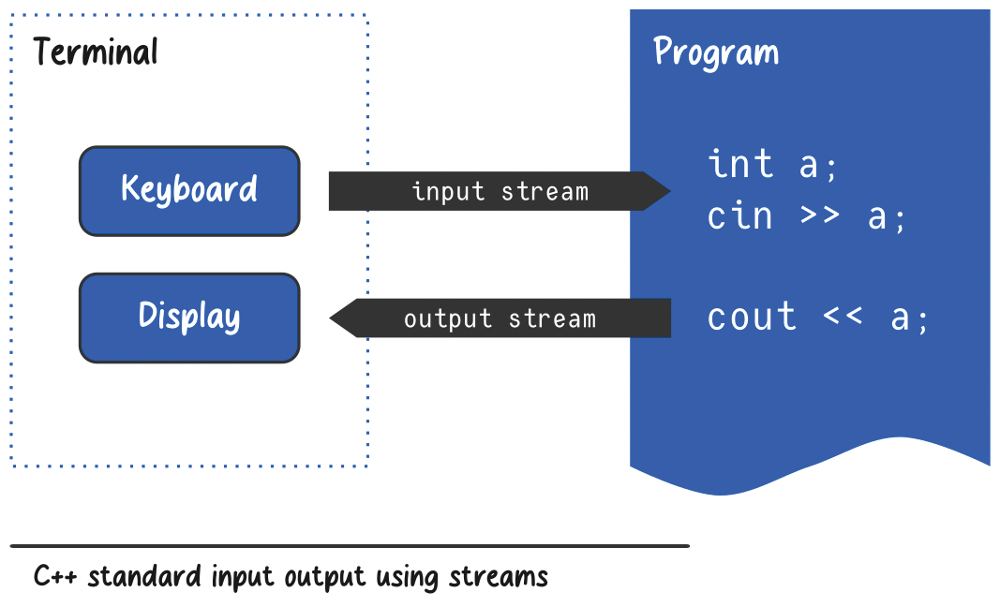
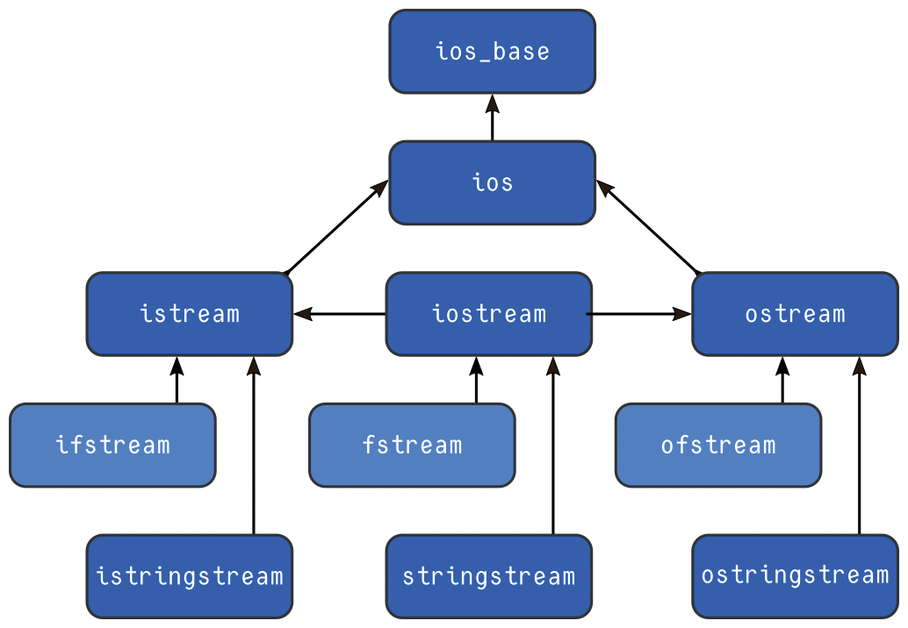

# C++ Streams

## Introduction to Streams

The STL input/output library provides classes and functions which allow for input and output operations. As you already know, C++ uses the concept of a **stream** for input and output operations.

So, let’s start with the definition of a stream:

> *A stream can be defined as **some kind of channel through which bytes are transmitted.***

We can either **read from** the channel or **write to** it. One end of the channel is often attached to some physical device like a **keyboard, display, or disk**.

Some channels are meant for:

* **Reading** — input
* **Writing** — output
* **Both** — input/output

In the case of an input channel, we could say that it is attached to a **source**.

For an output channel, we would say that it is bound to its **destination**.

### Streams and Data Representation

Although at the lowest level the stream deals with **raw characters** (in a general sense), that does not mean the data which are read from it or written to it must be characters.

It is the stream's task to **convert the data from and to the proper representation**.

### `cin` and `cout`

In the diagram below, you can see how standard input/output can be represented using the stream concept.

There are two streams represented in the program, both well-known as the `cin` and `cout` objects.

---

# The STL Input/Output Library

The STL input/output library provides **three families of streams** for use:

* **Console/terminal streams** — for console input/output.
  Console means the **keyboard and text display**.

* **File streams** — to read data from files and write data to files.

* **String streams** — which treat a string as a data source or data destination.

### Stream Class Hierarchy

As you can see in the diagram, the whole library is built as a **class hierarchy**.

We can distinguish three levels of I/O interfaces:

| Level         | Classes                                          | Purpose                   |
| ------------- | ------------------------------------------------ | ------------------------- |
| Console level | `istream`, `ostream`, `iostream`                 | Console input/output      |
| File level    | `ifstream`, `ofstream`, `fstream`                | File input/output         |
| String level  | `istringstream`, `ostringstream`, `stringstream` | String-based input/output |

